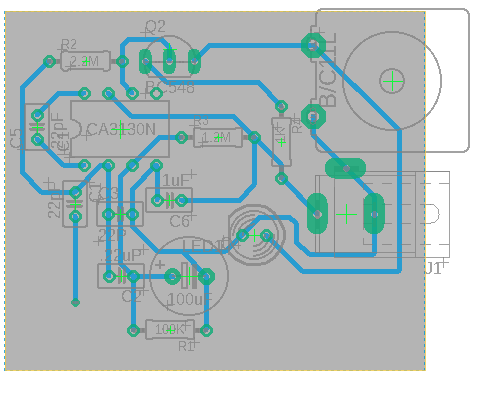

# 📞 Callphone Detection

Deteksi sederhana untuk mengetahui apakah seseorang sedang menggunakan handphone untuk menelepon. Proyek ini dirancang sebagai sistem ringan dengan komponen minimal untuk pengujian atau pembelajaran dasar sistem deteksi aktivitas.

---

## 🖼️ Mockup

| Schematic | Board |
|----------|--------|
|  |  |

---

## 🎯 Fitur

- Deteksi handphone yang sedang digunakan untuk menelepon
- Output sederhana (LED/buzzer atau sinyal digital)
- Cocok untuk prototipe awal atau pengujian sistem kecil

---

## 🧰 Komponen

- Sensor elektromagnetik / RF detector / sensor khusus lain (sesuai skematik)
- Arduino / ESP32 / microcontroller lainnya
- LED / Buzzer (opsional sebagai output indikator)
- Kabel jumper, breadboard, dan catu daya

---

## ⚙️ Cara Kerja Singkat

Sensor akan mendeteksi sinyal RF atau gelombang elektromagnetik yang khas saat handphone melakukan panggilan. Ketika sinyal tersebut terdeteksi, mikrokontroler akan memberikan output, misalnya menyalakan LED atau mengirim sinyal digital.

---

## 🚀 Instalasi & Penggunaan

1. Rakit komponen sesuai skematik
2. Upload kode ke mikrokontroler (lihat `callphone_detector.ino` atau `main.py`)
3. Uji sistem dengan melakukan panggilan telepon dekat sensor

---

## 📂 Struktur Proyek

