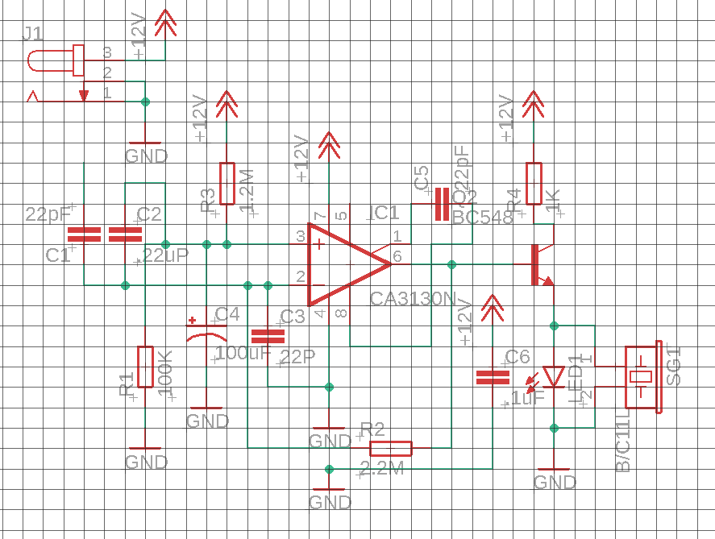
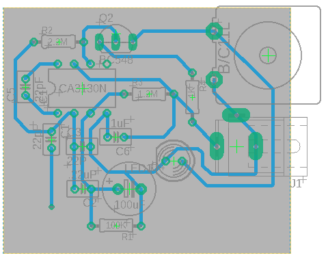

# 📞 Callphone Detection

Deteksi sederhana untuk mengetahui apakah seseorang sedang menggunakan handphone untuk menelepon. Proyek ini dirancang sebagai sistem ringan dengan komponen minimal untuk pengujian atau pembelajaran dasar sistem deteksi aktivitas. dapat dikembangkan lebih lanjut untuk mendeteksi penggunaan handphone dalam ruangan ujian

---

## 🖼️ Mockup

| Schematic | Board |
|----------|--------|
|  |  |

---

## 🎯 Fitur

- Deteksi handphone yang sedang digunakan untuk menelepon
- Output sederhana (LED dan buzzer)
- Cocok untuk prototipe awal dalam pembuatan pendeteksi kecurangan dalam ujian

---

## 🧰 Komponen

- Sensor elektromagnetik / RF detector / sensor khusus lain
- LED / Buzzer (opsional sebagai output indikator)
- Kabel jumper, breadboard, dan catu daya

---

## ⚙️ Cara Kerja Singkat

Sensor akan mendeteksi sinyal RF atau gelombang elektromagnetik yang khas saat handphone melakukan panggilan. Ketika sinyal tersebut terdeteksi, mikrokontroler akan memberikan output, menyalakan LED atau mengirim sinyal digital.

---

## 🚀 Instalasi & Penggunaan

1. Rakit komponen sesuai skematik
3. Uji sistem dengan melakukan panggilan telepon dekat sensor ataupun menjauhinya

---

